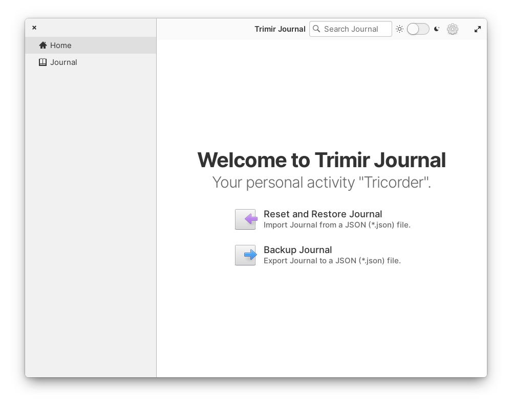
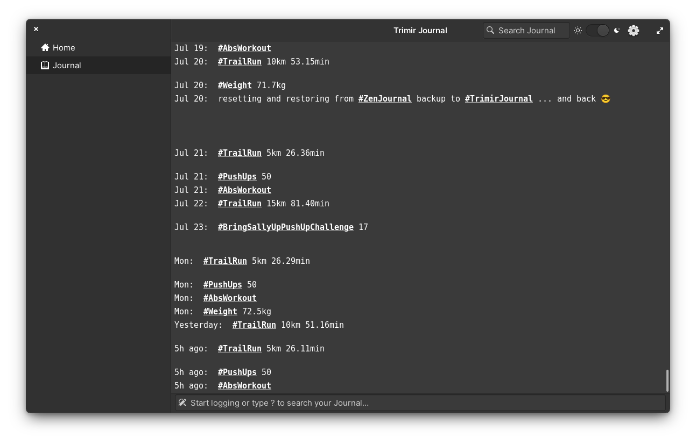

# Trimirj Journal — Your personal activity "Tricorder".

Designed and built for personal text journaling and activity tracking.

Write a diary, log your activities, keep track of your metrics.

Search, filter and evaluate your journal—your life.

## Features

* Write expressive journal entries with emoijs, organized with hashtags (i.e. "#linux rocks 😎️")
* Search your journal
* Filter your journal by hashtag
* Render timeline charts when filtering for "metric tags", i.e. a hashtag followed by a number with optional unit (e.g. "#Trailrun 5km")
* Backup and restore your journal to and from a JSON file, compatible with mobile app "ZenJournal - Minimalist Diary" (iOS, Android)—no affiliation

## Screenshots






## Made for [elementary OS](https://elementary.io/)

**Trimir Journal** is designed and developed on and for [elementary OS](https://elementary.io/).

The app will eventually (hopefully) be available for purchasing directly through AppCenter.

Purchasing the app will support the development and ensures instant updates straight from me. All this is to say: get it on AppCenter for the best, sustainable experience. 😀️

## Building and Installation

You'll need the following dependencies:

* libxml2-dev
* libgda-5.0-dev
* glib-2.0
* gobject-2.0
* gtk+-3.0
* libjson-glib-dev
* libgtksourceview-4.0-dev
* libhandy-1-dev
* libgranite-dev
* meson
* valac

```bash
sudo apt install \
    elementary-sdk \
    libgda-5.0-dev \
    libgtksourceview-4-dev
```

You'll also need to init and update these Git submodules with required subprojects (in `subprojects/` directory):

* [Live Chart](https://github.com/lcallarec/live-chart) a real-time charting library for GTK3 and Vala, based on [Cairo](https://cairographics.org/).

```bash
git submodule init
git submodule update
```

Run `meson build` to configure the build environment. Change to the build directory and run `ninja` to build

```bash
meson build --prefix=/usr
cd build
ninja
```

To install, use `ninja install`, then execute with `com.github.matthiasjg.trimirjournal`

```bash
ninja install
com.github.matthiasjg.trimirjournal
```

## Developing and Packaging

For development oneshould use `make`™️.

The `make` targets require two more tools being installed:

1. [vala-lint](https://github.com/vala-lang/vala-lint) to assure one is following the [elementary Code-Style guidelines](https://elementary.io/docs/code/reference#code-style)

2. [Gtk Inspector](https://elementary.io/docs/code/os-dev#gtk-inspector) (from ` elementary-sdk`)


```bash
# vala-lint
git clone https://github.com/vala-lang/vala-lint
cd vala-lint
sudo apt install cmake libvala-0.48-dev
meson build --prefix=/usr
cd build
ninja test
sudo ninja install

# gtk-inspector
gsettings set org.gtk.Settings.Debug enable-inspector-keybinding true
```

Useing the `make` targets is then as simple as:

```bash
# once
make
# recurring, each cycle
make yolo
```

## Translations (i18n)

The app is fully translatable.

Each time new translatable strings are added or old ones change, one should regenerate the `.pot` and `po` files using `make i18n`.

For new languages, just list them in the `po/LINGUAS` file and generate the new `.po` file with `make i18n`.

## Dev(Ops) Hints

### Editor / "IDE"

For me (currently, still) [Visual Studio Code](https://code.visualstudio.com/).

Install Princeton et al's uber-awesome [vala-vscode](https://marketplace.visualstudio.com/items?itemName=prince781.vala) ([src](https://github.com/Prince781/vala-vscode)) which requires [vala-language-server](https://github.com/Prince781/vala-language-server) to be installed.

### Flatbak build

```bash
# flatpak remote-add --if-not-exists --system appcenter https://flatpak.elementary.io/repo.flatpakrepo
# flatpak install -y appcenter io.elementary.Platform io.elementary.Sdk
flatpak-builder build com.github.matthiasjg.trimirjournal.yml --user --install --force-clean
flatpak run com.github.matthiasjg.trimirjournal
```

### Build .deb locally, though DEPRECATED

```bash
meson build --prefix=/usr
cd build
ninja
cd ..
dpkg-buildpackage
```

## Special Thanks & Credits

It is a true pleasure to develop on and for this platform.

Starting from the outstanding [elementary developer documentation](https://docs.elementary.io/develop/), the greater [Vala](https://wiki.gnome.org/Projects/Vala), [Valadoc](https://valadoc.org/) ecosystem to the [source code](https://github.com/elementary/) of the OS and bundled (original) apps to the [AppCenter](https://appcenter.elementary.io/) along with all the great and inspiring community apps.

Therefore THANK YOU team and community of elementary OS! ❤️
